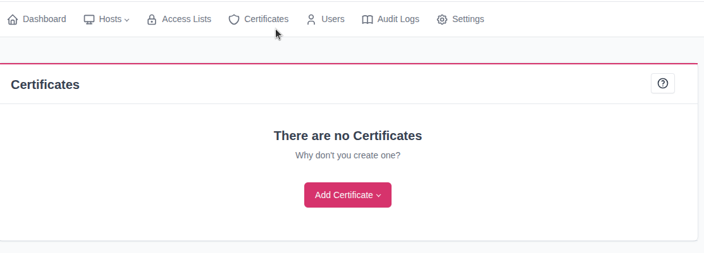
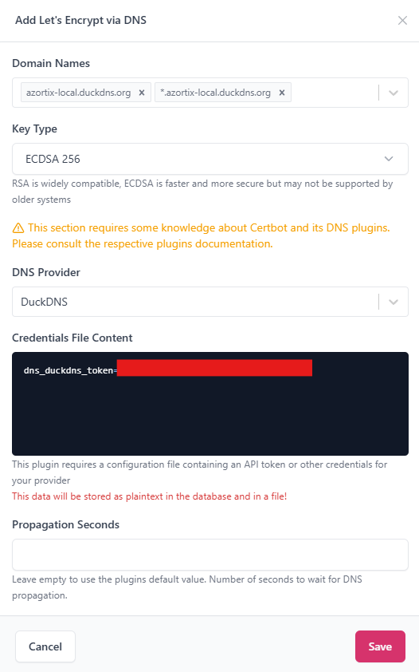
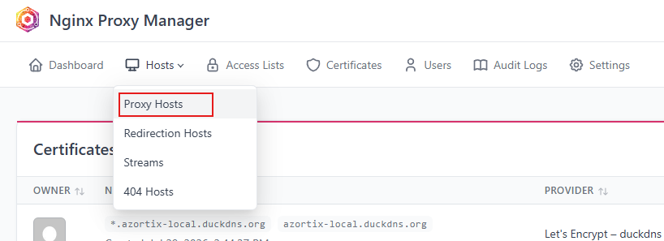
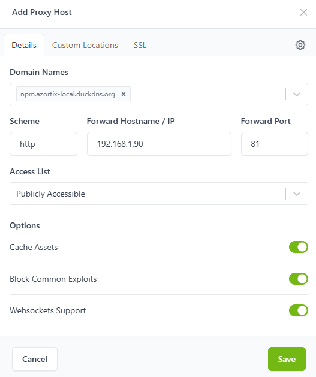
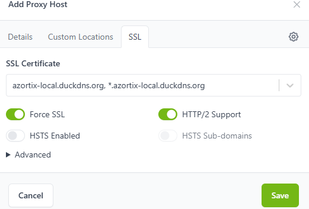
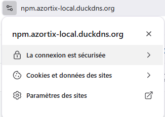

## Création du conteneur LXC
Créer un conteneur LXC avec les paramètres suivants :  

**Unprivileged** : Coché. Par sécurité, cela permet que le root du CT ne soit pas root de l'hôte.   
**Nesting** : Activé pour élargir l'accès aux namespaces, nous allons utiliser docker donc recommandé de l'activer.  
**Disk size** : 8GiB pour être sûrs de ne pas être limités.   
**Cores** : 1   
**Memory** : 512 MiB   
**Bridge** : vmbr0 pour que le conteneur soit directement présent sur le réseau local.   
**IPv4** : 192.168.1.90/24 en statique, pour garder cette adresse IP  
**Gateway IPv4** : 192.168.1.1

## Installation de docker et de Nginx Proxy Manager
Mettre le conteneur à jour : `apt update && apt full-upgrade -y`

Installer docker et docker compose : `apt install docker.io docker-compose-v2 -y`

Créer une arborescence pour le docker compose : 
```
mkdir nginx-proxy-manager
cd nginx-proxy-manager

nano docker-compose.yml
```

Maintenant, rédiger ou coller :  
```
services:
  npm:
    image: jc21/nginx-proxy-manager:latest
    container_name: nginx-proxy-manager
    restart: unless-stopped

    ports:
      - "80:80"
      - "81:81"
      - "443:443"

    volumes:
      - ./data:/data
      - ./letsencrypt:/etc/letsencrypt
```

Pull l'image et lancer le conteneur : `docker compose up -d`   

## Création d'un domaine
Le choix va se porter sur **Duck DNS** qui offre des domaines et sous domaines gratuits. Parfais pour notre utilisation.  
Se connecter puis créer un sous domaine, ici : azortix-local.duckdns.org  
Le lier à l'adresse IP privée de la machine : ``192.168.1.90``


## Configuration via interface web Nginx Proxy Manager

Accéder à l'interface web : http://192.168.1.90:81/  

### Création du certificat
Aller dans l'onglet **Certificates** puis **Add certificate** et choisir **Let's Encrypt via DNS**   



Compléter les informations avec le nom du domaine : azortix-local.duckdns.org et *.azortix-local.duckdns.org pour permettre des hôtes.  
Choisir le DNS comme DuckDNS et coller le token.  

 

### Mise en place du reverse proxy
Aller dans l'onglet **Hosts**, puis **Proxy Hosts**.  Cliquer sur **Add Proxy Host**.  



Puis entrer les informations comme ci-dessous en adaptant l'IP et le port utilisés :  

   

Dans l'onglet **SSL**, sélectionner le certificat SSL créé plus tôt, et cocher le support SSL et HTTP/2.   

   

Une fois l'hôte proxy créé, il suffit de cliquer sur le lien, permettant d'accéder au service via HTTPS :  

   

Il est maintenant possible de créer de nouveaux hôtes proxy pour différents services.


## Q & A
**Question**

Préférer un certificat HTTP ou DNS ?

**Réponse**

L'intérêt d'un certificat DNS est qu'il permet de ne aps ouvrir un port sur le routeur. Evitant ainsi tout attaque extérieure. Cela nécessitera en revanche d'accéder au réseau privé (possiblement par VPN) pour accéder au service en HTTPS.

**Question**

Dois-je entrer mon IP publique du duckdns ou bien l'IP de ma machine ?

**Réponse**

Ici, l'idée est de ne pas ouvrir de ports à l'extérieur, et d'accéder aux services depuis le réseau privé. C'est donc l'IP privée qui sera entrée. Un VPN peut être envisagé si besoin d'accéder aux services depuis l'extérieur.
